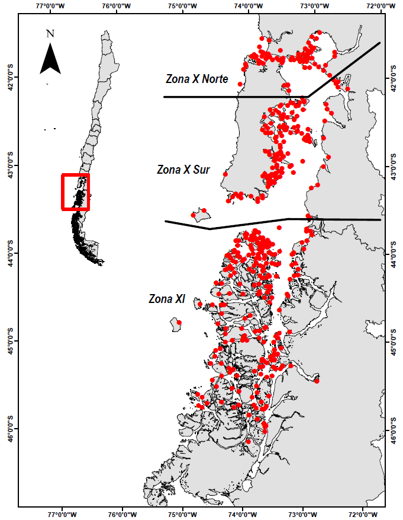

# Revisión de la Evaluación de stock de erizo de la Unidad de Pesquería de aguas interiores de la Región de Los Lagos

## Resumen

+++++++

El erizo de mar rojo (*Loxechinus albus*) es uno de los recursos de invertebrados bentónicos importantes más económicos, sociales y ecológicos en Chile y la pesquería de invertebrados más grande del mundo que representa entre el 60% y el 70% de los desembarques mundiales de erizos de mar. La pesquería comienza a mediados de los 60 y a mediados de los 80 experimenta una gran expansión, pero ha experimentado una disminución sustancial en los desembarques desde 2005. El área donde se distribuye la pesca es extensa (\~ 2500 km de costa), que no realizó encuestas independientes. Utilizando parámetros de la historia de vida de la pesquería y el erizo derivados de estudios científicos, junto con los datos disponibles recopilados del programa de monitoreo pesquero, realizamos una evaluación formal de las poblaciones de erizos de mar para conocer los niveles de estado y de explotación.

Se evalúa la incertidumbre en la estimación de PBRs y determinación del estatus del erizo para cada unidad de pesquería?. Se estructuran tres áreas de evaluación en el área de estudio basadas en cuestiones operativas de pesca y suficiencia de datos, y se lleva a cabo una estandarización de los rendimientos de pesca. Este estudio muestra que las 3 poblaciones analizadas tienen diferentes niveles de biomasa reproductora disponibles, pero todas muestran signos claros de agotamiento con respecto a la biomasa virgen estimada. Estos resultados son relevantes al momento de tomar decisiones por parte de la administración, para definir los planes de recuperación.

**Palabras clave:** stock assessment, *Lochexinus albus*, modelo estructurado a la talla, estructuración espacial, estatus del recurso.

\pagebreak

## 1. Antecedentes

1.  Historia de la pesquería del erizo en Chile

    La pesquería del erizo *Loxechinus albus* es una de las más importantes en términos económicos, social y ecológico en Chile (Fernandez *et al*., 2000;  Guisado *et al*., 1998; Moreno *et al*., 2007; J. A. Vásquez, 2001) (Guisado *et al*., 1998; Stotz, 2007). (Guisado *et al*., 1998; Molinet *et al*., 2013; Moreno *et al*., 2007, 2011; Vásquez *et al*., 1984) Su explotación comercial data de los años 60's la cual aporta con el mayor desembarque de erizos del planeta (Moreno *et al*., 2007; Stotz, 2007; Andrew *et al*., 2002).  (FAO, 2014; Andrew *et al*., 2002), con desembarques alrededor de 30.000 t anuales en los últimos veinte años. La pesquería se desarrolla principalmente entre las regiones de Los Lagos (X Región), Aysén (XI Región) y Magallanes (XII Región) (Sernapesca, 2016), lo que constituye casi 1.700 kilómetros lineales de costa. La flota es principalmente artesanal, operado por buceo hocka, botes de 8 a 12 metros de eslora, los cuales explotan el recurso en cientos de parches distribuidos a lo largo de canales y fiordos de la zona austral de Chile,  (Molinet *et al*., 2013; Molinet *et al*., 2010; Roa-Ureta *et al*., 2015) (**Fig 1**). Reconociendo sus extensas zonas de operación y altos niveles de producción, la pesquería del erizo ya no es considerada de pequeña escala (Moreno *et al*., 2007).

    **Insertar gráfico de desembarques históricos de las distintas unidades del stock del erizo**

2.  Histórica de la pesquería del erizo en el mundo

3.  Manejo de la pesquería del erizo en Chile

    La administración del erizo en Chile está regida por la Ley General de Pesca y Acuicultura, Ley 20.657 (febrero de 2013), en el marco de la cual se formaliza el Plan de Manejo (PM) de este recurso que se venía trabajando desde el año 2005 (Moreno *et al*., 2007), precisando los objetivos, indicadores, medidas de conservación y administración que deben aplicarse y la confección de un programa de recuperación. (Techeira, 2017). (**Fig. 1**). Este PM contiene elementos relevantes respecto a su administración como son; tamaño mínimo de extracción legal, vedas de extracción y recientemente cuotas de cosecha, las que se establecen cada año por recomendación de un comité científico en asesoría del cómite de manejo (sic). Cabe señalar que, si bien, el establecimiento de cuotas de cosecha ha servido para el ordenamiento y gobernabilidad de esta pesquería, la evaluación de stock de este recurso es un proceso relativamente nuevo (3 años), dado que el enfoque de administración de pesquerías bentónicas en Chile, obedece principalmente al manejo basado en objetivos e indicadores referidos a la dimensión socioeconómica en la cual se insertan.

4.  Manejo de la pesquería del erizo en en mundo

5.  Cómo se determina el estatus del erizo en Chile

    Actualmente la administración pesquera manifiesta la necesidad de desarrollo e implementación metodológica de herramientas cuantitativas que den cuenta del estado de los stocks de forma de procurar antecedentes técnicamente fundamentados para el proceso de toma de decisiones referidas a las cuotas de cosecha, acercando las pesquerías bentónicas a los procedimientos de evaluación de stock con rigor científico. Esta situación ha promovido la adaptación de modelos estadísticos que representen la dinámica poblacional de este tipo de recursos, para así reconocer en primer lugar el estado de explotación del recurso, los niveles de biomasa disponible en la zona de aplicación del plan y, por último, proposición de cuotas de captura que propendan a un MRS (Máximo Rendimiento Sostenido).

6.  Cómo se determina el estatus del erizo en el Mundo

7.  **Cómo se Calcula de PBRs en bentónicos en Chile**

    para proponer recomendaciones bajo un enfoque modelo-basado, se debe establecer un marco de referencia biológico para la pesquería del erizo. En este sentido, la mayoría de los marcos de referencia internacionales de ordenación pesquera modernos y actualmente vigentes, se sustentan en el concepto del Rendimiento Máximo Sostenible (RMS).

    En este aspecto se propone la utilización de Puntos Biológicos de Referencias (PBR) que tiendan al RMS, de acuerdo a lo expresado por la comunidad científica pesquera mundial. Mayormente se han aplicado PBR *proxies* dada la dificulta de estimación del MRS (Hilborn, 2002; Payá *et al*., 2014). Por ejemplo, inicialmente para evitar la sobrepesca por crecimiento usando como PBR objetivo F0.1 y el PBR límite Fmax, basados en el rendimiento por recluta (Gulland y Boerema 1973). Luego, para prevenir la sobrepesca por reclutamiento se propone el uso de un PBR objetivo F40%BDPR y como PBR límite F20%BDPR, basados en la biomasa desovante por recluta (Clark 1991 y 1993, Mace 1994, Mace y Sissenwine 1993). Más recientemente también ha usado como PBR objetivo 40%BD0 (biomasa desovante que corresponde al 40% de la biomasa desovante virginal) y como límite 20%BD0 (cita). A nivel mundial, se han propuesto marcos de referencia para pesquerías de erizo. Por ejemplo en Maine, se estimó usar como referencia el F0,1(Chen *et al*., 2003; Chen and Hunter, 2003; Perry *et al.*, 2002). (Botsford *et al*., 2004) proponen el uso de PBR basado en el potencial reproductivo (SPR) como un proxy del MRS de acuerdo a lo establecido por (Gabriel and Mace, 1975; Goodyear, 1993) para las pesquerías del erizo de California.

8.  **Cómo se Cálcula de PBRs en el mundo**

9.  **Identificación de la Problemática que se quiere abordar en este estudio**

Manejo actual de la pesquería de erizo no cuenta con la determinación del estatus a partir de puntos biológicos de referencia

En el caso de especies sedentarias como moluscos y en este caso equinodermos, ciertas características intrínsecas poblacionales imponen restricciones adicionales a la aplicación de modelos convencionales de evaluación de stocks, Orenzans & Jamieson (1998), (Punt *et al*., 2013) . Punt *et al*. (2013) hicieron una detallada revisión de las consideraciones metodológicas y estadísticas que hay que enfrentar para la modelación en crustáceos y moluscos. (Roa-Ureta *et al*., 2015) propusieron un modelo.... Un modelo dinámico de población estructurado por talla es deseable para la pesquería porque los erizos son difíciles de envejecer y tienen grandes variaciones en el crecimiento entre individuos (Quinn y Deriso, 1999).

El entendimiento de la dinámica del stock de erizos es esencial, y puede lograrse desarrollando un modelo dinámico de población y, posteriormente, una estimación confiable de los parámetros del modelo con métodos estadísticos adecuados (Hilborn y Walters, 1992; Chen y Paloheimo, 1998; Walters, 1998).

Para conocer el estado de la población en el área de estudio, el cual utiliza distintas fuentes de información; 1) Monitoreo Base de Datos del FOP Esto permite obtener indicadores de la abundancia como la CPUE, las estructuras de tamaños, el peso medio a la talla, entre otros. 2) Estudios científicos parámetros del ciclo vital de la especie, mortalidad natural, crecimiento y ojiva de madurez, entre otros. 3) Estadísticas oficiales de desembarques (Sernapesca, 2018) las que a su vez son corregidas en función del criterio experto y de la información del monitoreo de la pesquería.  Y, por último, integramos información independiente de la pesquería, extraída de un programa de estudios llamado "Red de Estaciones fijas" (Barahona, 2017), el cual contiene estructuras de tallas y densidad poblacional de erizo usados como indicadores. En este sentido, un modelo de evaluación de stock estructurado a la talla con dinámica a la edad estimula el uso de las distintas piezas de información disponible y tiene un rol de integración del conocimiento.

6.  Objetivo del estudio

Cuantificar la incertidumbre asociada a los PBR de la pesquería del erizo *Loxechinus albus* frente a diferentes escenarios de la naturaleza.

Este trabajo tiene como objetivo cuantificar la incertidumbre asociada a los supuestos mas sensibles para este tipo de pesquerías, como son; relación stock-recluta, mortalidad natural, parámetros de crecimiento, etc. También es posible corregir sesgos de estimación a través de perfiles y análisis retrospectivos. Las recomendaciones del peer review serán incorporadas en este artículo.

En función de los antecedentes, consideramos que un modelo de dinámica poblacional para la población de erizos debería proporcionar estimaciones fiables de los parámetros del modelo con métodos estadísticos adecuados (Hilborn y Walters, 1992; Chen y Paloheimo, 1998; Walters, 1998) y de las variables de estado (biomasa, abundancia) y flujo (mortalidad por pesca o tasas de explotación) en el área de distribución del recurso y la pesquería, las cuales deben contener referencias basadas en los proxis del RMS anteriormente descritos. Para esto, implementamos un protocolo de evaluación de stock, cuyo objetivo es recomendar un marco biológico de referencia basado en un enfoque modelo basado para determinar Fmrs y Bmrs con un modelo estructurado en tallas con dinámica en edad y desarrollar una estrategia de manejo adecuada.

\pagebreak

## 2. Metodología

### 2.1. Área de estudio

La estructuración espacial de las poblaciones bentónicas que sostienen las pesquerías en términos de monitoreo, evaluación y manejo. Para ello, Molinet *et al*. (2011) realizó una zonificación en función de un análisis de similitudes y del juicio experto de su pesquería, flota. Esto se tradujo en el establecimiento de 12 zonas agrupadas por características comunes. De acuerdo a esta segmentación espacial, y utilizando estos polígonos, se realizó una reagrupación por zonas de los polígonos en función similitudes geográficas, así como también por unidades de administración, en donde se establecieron 3 zonas, a saber, 1) zona X Norte, 2) zona X Sur y 3) zona XI. De acuerdo al monitoreo de la pesquería (IFOP, 2017), entre estas 3 zonas se distribuyen cerca de 250 parches agrupados en zonas de pesca, las cuales son reconocidas como "procendencias", las cuales son visitadas en cada temporada por los pescadores (**Figura 1**).

{width="12cm"}

### 2.2. Período de estudio

### 2.3. Modelo conceptual

-   El stock de erizo está constituido por 3 sub-unidades de stock, correspondientes a la Unidad de X Norte, Unidad de X Sur y la Unidad de XI región.

-   La mortalidad natural es conocida y constante entre años y edades.

-   La mortalidad natural y por pesca son simultáneas (ecuación de Baranov).

-   El patrón de vulnerabilidad de los individuos es a la edad y sigue un modelo logístico.

-   El modelo supone que el erizo presenta en cada unidad de análisis un stock cerrado y una población compuesta por no más de 12 grupos de edades.

-   El reclutamiento (segundo año de edad) es el resultado del "desove" de conjunto de bancos vecinos y su sobrevivencia es modulada principalmente por cuestiones ambientales, lo que significa que los reclutamientos responden a procesos principalmente estocásticos donde la función stock-recluta es difusa.

### 2.2. Modelo de evaluación de stock

#### 2.2.2. Datos de entrada

-   Desembarques

-   Frecuencia de tallas del monitoreo

-   Captura por unidad de esfuerzo

-   Parámetros de crecimiento y mortalidad natural

### 2.3. Puntos Biológicos de Referencia

#### 2.3.1. Cálculo de BD~0~ , BD~RMS~ y BD~LIM~

#### 2.3.2. Cálculo de F~RMS~

### 2.4. Diagrama de Fases de explotación

\pagebreak

## 3. Resultados

```{r llama codigos, warning=F, include=T, message=F, echo=FALSE}

library(stringr)
library(lattice)
library(ggplot2)
library(reshape)
library(dplyr)
library(ggthemes)
library(stringr)
library(knitr)

#raiz           <-"C:\\MJZ\\CTP2021\\"
#carpetabase    <-paste(raiz,"\\BENTONICOS\\Assessment_erizo_Paper\\Cap_3\\",sep="")
carpetabase    <-getwd()

# FIGURAS
dir.Fig        <-"Figuras/"
fig            <-c("pdf","bmp")

#DIRECTORIOS
dir.0<-carpetabase
dir.1<-paste(dir.0,"/codigos_admb",sep="")
dir.2<-paste(dir.0,"/RetrospectivoSept",sep="")
dir.3<-paste(dir.0,"/VerosimilitudSept",sep="")

dir.fun        <-paste(dir.0,"/funciones/",sep="")

#FUNCIONES
source(paste(dir.fun,"functions.R",sep=""))
source(paste(dir.fun,"Fn_PBRs.R",sep=""))
source(paste(dir.fun,"Fn_Retrospectivo.R",sep=""))
source(paste(dir.fun,"Fn_Verosimilitud.R",sep=""))
source(paste(dir.fun,"Fn_DiagramaFase.R",sep=""))


```

```{r PRIMER PASO CORRE MODELOS BASE, eval=FALSE, echo=FALSE, warning=FALSE}

setwd(dir.1)

#para mac
#system("~/admb-12.2/admb MAETXN")
#system("./MAETXN")

#system("~/admb-12.2/admb MAETXS")
#system("./MAETXS")

system("~/admb-12.2/admb MAETXI")
system("./MAETXI")
```

```{r lee_datos, echo=F, warning=FALSE}
setwd(dir.1)

# Zona X Norte
data1        <- lisread("MAETXN.dat") 
names(data1) <- str_trim(names(data1), side="right")
dat1         <- data1
rep1         <- reptoRlist("MAETXN.rep")
std1         <- read.table("MAETXN.std",header=T,sep="",na="NA",fill=T) 

# Zona X Sur
data2        <- lisread("MAETXS.dat") 
names(data2) <- str_trim(names(data2), side="right")
dat2         <- data2
rep2         <- reptoRlist("MAETXS.rep")
std2         <- read.table("MAETXS.std",header=T,sep="",na="NA",fill=T) 

# Zona XI

data3        <- lisread("MAETXI.dat") 
names(data3) <- str_trim(names(data3), side="right")
dat3         <- data3
rep3         <- reptoRlist("MAETXI.rep")
std3         <- read.table("MAETXI.std",header=T,sep="",na="NA",fill=T) 


```

### Análisis exploratorios

```{r datInd, warning=F, include=T, message=F, echo=FALSE,fig.height=6,fig.width=6,fig.align="center",fig.path=dir.Fig,dev=fig, fig.cap="Datos de entrada al modelo de evaluación de stock para las tres unidades de stock de erizo"}

desXN_obs <- data.frame(rep1$Desemb_obs)
desXS_obs <- data.frame(rep2$Desemb_obs)
desXI_obs <- data.frame(rep3$Desemb_obs)

cpueXN_obs  <- data.frame(rep1$CPUE_obs)
cpueXS_obs  <- data.frame(rep2$CPUE_obs)
cpueXI_obs  <- data.frame(rep3$CPUE_obs)

yearc   <- rep1$years 
nyearc  <-length(yearc)  

 obscpueXN  <- as.data.frame(cpueXN_obs) %>% mutate(year=yearc) %>% melt(id.vars='year') %>% mutate(type='CPUE_XNorte')
 obscpueXS  <- as.data.frame(cpueXS_obs) %>% mutate(year=yearc) %>% melt(id.vars='year') %>% mutate(type='CPUE_XSur')
 obscpueXI  <- as.data.frame(cpueXI_obs) %>% mutate(year=yearc) %>% melt(id.vars='year') %>% mutate(type='CPUE_XI')
 
 obsDXN <- as.data.frame(desXN_obs) %>% mutate(year=yearc) %>% melt(id.vars='year') %>% mutate(type='Desembarques_XNorte')
 obsDXS <- as.data.frame(desXS_obs) %>% mutate(year=yearc) %>% melt(id.vars='year') %>% mutate(type='Desembarques_XSur')
 obsDXI <- as.data.frame(desXI_obs) %>% mutate(year=yearc) %>% melt(id.vars='year') %>% mutate(type='Desembarques_XI')
 
 Ind  <-rbind(obscpueXN,obscpueXS,obscpueXI,obsDXN,obsDXS,obsDXI)

p <- ggplot()  +
  geom_bar(data=Ind, aes(x=year, y =value), stat="identity", fill='gray66', 
                   color = 'gray28') + 
    facet_wrap(~type,scale="free",dir = 'v', as.table = TRUE) + labs(x="Años", y="")
p +  theme(panel.background = element_rect(fill ="gray99")) + theme(panel.grid=element_line(color="gray66"))


```


```{r Ajustes_indices, echo=FALSE, message=FALSE, warning=FALSE, include=T}
library(patchwork)
yrs   <- rep1$years
nyrs  <- length(yrs)
lasty <- yrs[nyrs]
cvcpue   <-0.20
cvdes   <-0.05

# Erizo X Norte
ind_obsXN           <- cbind(rep1$CPUE_obs, rep1$Desemb_obs); ind_obsXN[ind_obsXN==0] <- NA
colnames(ind_obsXN) <- c('CPUE', 'Desembarques') 
indXN               <- data.frame(ind_obsXN) %>% mutate(Asesoria='observado') %>% mutate (yrs= yrs) %>% melt(id.var=c('yrs', 'Asesoria'))  

ind_predXN           <- cbind(c(rep1$CPUE_pred), c(rep1$Desemb_pred)) 
colnames(ind_predXN) <- c('CPUE', 'Desembarques') 
predXN               <- data.frame(ind_predXN) %>% mutate (Asesoria='Índices') %>% mutate (yrs= yrs)  %>% melt(id.var=c('yrs', 'Asesoria'))

baseXN <- data.frame(rbind(indXN, predXN))  

# Erizo X Sur
ind_obsXS           <- cbind(rep2$CPUE_obs, rep2$Desemb_obs); ind_obsXS[ind_obsXS==0] <- NA
colnames(ind_obsXS) <- c('CPUE', 'Desembarques') 
indXS               <- data.frame(ind_obsXS) %>% mutate(Asesoria='observado') %>% mutate (yrs= yrs) %>% melt(id.var=c('yrs', 'Asesoria'))  

ind_predXS           <- cbind(c(rep2$CPUE_pred), c(rep2$Desemb_pred)) 
colnames(ind_predXS) <- c('CPUE', 'Desembarques') 
predXS               <- data.frame(ind_predXS) %>% mutate (Asesoria='Índices') %>% mutate (yrs= yrs)  %>% melt(id.var=c('yrs', 'Asesoria'))

baseXS <- data.frame(rbind(indXS, predXS))  

# Erizo XI
ind_obsXI           <- cbind(rep3$CPUE_obs, rep3$Desemb_obs); ind_obsXI[ind_obsXI==0] <- NA
colnames(ind_obsXI) <- c('CPUE', 'Desembarques') 
indXI               <- data.frame(ind_obsXI) %>% mutate(Asesoria='observado') %>% mutate (yrs= yrs) %>% melt(id.var=c('yrs', 'Asesoria'))  

ind_predXI           <- cbind(c(rep3$CPUE_pred), c(rep3$Desemb_pred)) 
colnames(ind_predXI) <- c('CPUE', 'Desembarques') 
predXI               <- data.frame(ind_predXI) %>% mutate (Asesoria='Índices') %>% mutate (yrs= yrs)  %>% melt(id.var=c('yrs', 'Asesoria'))

baseXI <- data.frame(rbind(indXI, predXI))  

```


```{r  ajustes_cpue, echo=FALSE, fig.align="center", fig.height=6, fig.path=dir.Fig, fig.width=6, message=FALSE, warning=FALSE, dev=fig, include=T , fig.cap="Ajustes de la CPUE de las tres unidades de stock de erizo"}

cpueXN <- ggplot(baseXN %>% filter(Asesoria!='observado', variable=='CPUE'), 
       aes(yrs,value)) + 
       geom_line(aes(colour=Asesoria), size=0.8) +
       scale_colour_manual(values=c('black')) +
       geom_point(data = baseXN %>% filter(Asesoria=='observado', variable=='CPUE'),
       aes(yrs,value), shape = 19, colour = 2) +
       geom_errorbar(data = baseXN %>% filter(Asesoria=='observado', variable=='CPUE'),
       aes(ymin = value*exp(-1.96*cvcpue), ymax = value*exp(1.96*cvcpue)), color = 'gray30') +
       scale_x_continuous(breaks = seq(from = 1960, to = 2020, by = 5)) +
       labs(x = '', y = '') +
       theme_bw(base_size=9) + 
       ggtitle('CPUE_XN')+
       theme(plot.title = element_text(hjust = 0.5),legend.position="none")

cpueXS <- ggplot(baseXS %>% filter(Asesoria!='observado', variable=='CPUE'), 
       aes(yrs,value)) + 
       geom_line(aes(colour=Asesoria), size=0.8) +
       scale_colour_manual(values=c('black')) +
       geom_point(data = baseXS %>% filter(Asesoria=='observado', variable=='CPUE'),
       aes(yrs,value), shape = 19, colour = 2) +
       geom_errorbar(data = baseXS %>% filter(Asesoria=='observado', variable=='CPUE'),
       aes(ymin = value*exp(-1.96*cvcpue), ymax = value*exp(1.96*cvcpue)), color = 'gray30') +
       scale_x_continuous(breaks = seq(from = 1960, to = 2020, by = 5)) +
       labs(x = '', y = '') +
       theme_bw(base_size=9) + 
       ggtitle('CPUE_XS')+
       theme(plot.title = element_text(hjust = 0.5),legend.position="none")

cpueXI <- ggplot(baseXI %>% filter(Asesoria!='observado', variable=='CPUE'), 
       aes(yrs,value)) + 
       geom_line(aes(colour=Asesoria), size=0.8) +
       scale_colour_manual(values=c('black')) +
       geom_point(data = baseXI %>% filter(Asesoria=='observado', variable=='CPUE'),
       aes(yrs,value), shape = 19, colour = 'gray30') +
       geom_errorbar(data = baseXI %>% filter(Asesoria=='observado', variable=='CPUE'),
       aes(ymin = value*exp(-1.96*cvcpue), ymax = value*exp(1.96*cvcpue)), color = 'gray30') +
       scale_x_continuous(breaks = seq(from = 1960, to = 2020, by = 5)) +
       labs(x = '', y = '') +
       theme_bw(base_size=9) + 
       ggtitle('CPUE_XI')+
       theme(plot.title = element_text(hjust = 0.5),legend.position="none")


cpueXN/cpueXS/cpueXI  + plot_layout(guides="collect")
```


```{r  ajustes_desembarques, echo=FALSE, fig.align="center", fig.height=6, fig.path=dir.Fig, fig.width=6, message=FALSE, warning=FALSE, dev=fig, include=T, fig.cap="Ajustes de los desembarques de las tres unidades de stock de erizo"}

dXN   <- ggplot(baseXN %>% filter(Asesoria!='observado', variable=='Desembarques'), 
       aes(yrs,value)) +
       geom_line(aes(colour=Asesoria), size=0.8) +
       scale_colour_manual(values=c('black')) +
       geom_point(data = baseXN %>% filter(Asesoria=='observado', variable=='Desembarques'),
       aes(yrs,value), shape = 19, colour = 'gray30') +
       geom_errorbar(data = baseXN %>% filter(Asesoria=='observado', variable=='Desembarques'),
       aes(ymin = value*exp(-1.96*cvdes), ymax = value*exp(1.96*cvdes)), color = 'gray30') +
       scale_x_continuous(breaks = seq(from = 1960, to = 2020, by = 5)) +
       labs(x = '', y = 'Toneladas ') +
       theme_bw(base_size=9) + 
       ggtitle('Desembarques_XN') +
       theme(plot.title = element_text(hjust = 0.5),legend.position="none")

dXS   <- ggplot(baseXS %>% filter(Asesoria!='observado', variable=='Desembarques'), 
       aes(yrs,value)) +
       geom_line(aes(colour=Asesoria), size=0.8) +
       scale_colour_manual(values=c('black')) +
       geom_point(data = baseXS %>% filter(Asesoria=='observado', variable=='Desembarques'),
       aes(yrs,value), shape = 19, colour = 'gray30') +
       geom_errorbar(data = baseXS %>% filter(Asesoria=='observado', variable=='Desembarques'),
       aes(ymin = value*exp(-1.96*cvdes), ymax = value*exp(1.96*cvdes)), color = 'gray30') +
       scale_x_continuous(breaks = seq(from = 1960, to = 2020, by = 5)) +
       labs(x = '', y = 'Toneladas ') +
       theme_bw(base_size=9) + 
       ggtitle('Desembarques_XS') +
       theme(plot.title = element_text(hjust = 0.5),legend.position="none")

dXI   <- ggplot(baseXI %>% filter(Asesoria!='observado', variable=='Desembarques'), 
       aes(yrs,value)) +
       geom_line(aes(colour=Asesoria), size=0.8) +
       scale_colour_manual(values=c('black')) +
       geom_point(data = baseXI %>% filter(Asesoria=='observado', variable=='Desembarques'),
       aes(yrs,value), shape = 19, colour = 'gray30') +
       geom_errorbar(data = baseXI %>% filter(Asesoria=='observado', variable=='Desembarques'),
       aes(ymin = value*exp(-1.96*cvdes), ymax = value*exp(1.96*cvdes)), color = 'gray30') +
       scale_x_continuous(breaks = seq(from = 1960, to = 2020, by = 5)) +
       labs(x = '', y = 'Toneladas ') +
       theme_bw(base_size=9) + 
       ggtitle('Desembarques_XI') +
       theme(plot.title = element_text(hjust = 0.5),legend.position="none")


dXN/dXS/dXI + plot_layout(guides="collect")
```


```{r ajustesCompFXN,warning=F, include=T, message=F, echo=FALSE,fig.height=8,fig.width=8,fig.align="center",fig.path=dir.Fig,dev=fig, fig.cap="Ajustes de la proporción de tallas de erizo de la zona XN"}
age  <-rep1$Tallas                                          
nage<-length(age)   

etcf1_obs <- data.frame(rep1$pobs)
etcf1_pre <- rbind(rep1$ppred) 

yearc1   <- rep1$years
nyearc1  <- length(yearc1)  

 obs  <- as.data.frame(etcf1_obs) %>% mutate(year=yearc1) %>% melt(id.vars='year') %>%
              mutate(edad = rep(age, each=nyearc1)) %>% mutate(type='obs')
 
 pred_sep <- as.data.frame(etcf1_pre) %>% mutate(year=yearc1) %>% melt(id.vars='year') %>%
              mutate(edad = rep(age, each=nyearc1)) %>% mutate(type='')
 
  mat  <- rbind(obs,pred_sep)
 
  fig1 <- ggplot(filter(mat, type=='obs')) + 
          geom_bar(aes(x = edad, y = value), stat="identity", fill='gray66', color = 'gray78') + 
          facet_wrap(~year, dir = 'v', as.table = TRUE) + labs(x = 'Edad', y = 'Proporción') +
          geom_line(data = mat %>% filter(type != 'obs'), aes(x = edad, y = value, colour=type)) +
          scale_colour_manual(values=c('red'),name="") +
          theme(panel.background = element_rect(fill ="gray99")) + theme(panel.grid=element_line(color=NA)) +
          ggtitle("FLOTA_XNorte") + theme(plot.title = element_text(size = 12))
  fig1

```


```{r ajustesCompFXS,warning=F, include=T, message=F, echo=FALSE,fig.height=8,fig.width=8,fig.align="center",fig.path=dir.Fig,dev=fig,  fig.cap="Ajustes de la proporción de tallas de erizo de la zona XS"}
age  <-rep2$Tallas                                          
nage<-length(age)   

etcf1_obs <- data.frame(rep2$pobs)
etcf1_pre <- rbind(rep2$ppred) 

yearc1   <- rep2$years
nyearc1  <- length(yearc1)  

 obs  <- as.data.frame(etcf1_obs) %>% mutate(year=yearc1) %>% melt(id.vars='year') %>%
              mutate(edad = rep(age, each=nyearc1)) %>% mutate(type='obs')
 
 pred_sep <- as.data.frame(etcf1_pre) %>% mutate(year=yearc1) %>% melt(id.vars='year') %>%
              mutate(edad = rep(age, each=nyearc1)) %>% mutate(type='')
 
  mat  <- rbind(obs,pred_sep)
 
  fig1 <- ggplot(filter(mat, type=='obs')) + 
          geom_bar(aes(x = edad, y = value), stat="identity", fill='gray66', color = 'gray78') + 
          facet_wrap(~year, dir = 'v', as.table = TRUE) + labs(x = 'Edad', y = 'Proporción') +
          geom_line(data = mat %>% filter(type != 'obs'), aes(x = edad, y = value, colour=type)) +
          scale_colour_manual(values=c('red'),name="") +
          theme(panel.background = element_rect(fill ="gray99")) + theme(panel.grid=element_line(color=NA)) +
          ggtitle("FLOTA_XSur") + theme(plot.title = element_text(size = 12))
  fig1

```


```{r ajustesCompFXI,warning=F, include=T, message=F, echo=FALSE,fig.height=8,fig.width=8,fig.align="center",fig.path=dir.Fig,dev=fig, fig.cap="Ajustes de la proporción de tallas de erizo de la zona XI"}
age  <-rep3$Tallas                                          
nage<-length(age)   

etcf1_obs <- data.frame(rep3$pobs)
etcf1_pre <- rbind(rep3$ppred) 

yearc1   <- rep3$years
nyearc1  <- length(yearc1)  

 obs  <- as.data.frame(etcf1_obs) %>% mutate(year=yearc1) %>% melt(id.vars='year') %>%
              mutate(edad = rep(age, each=nyearc1)) %>% mutate(type='obs')
 
 pred_sep <- as.data.frame(etcf1_pre) %>% mutate(year=yearc1) %>% melt(id.vars='year') %>%
              mutate(edad = rep(age, each=nyearc1)) %>% mutate(type='')
 
  mat  <- rbind(obs,pred_sep)
 
  fig1 <- ggplot(filter(mat, type=='obs')) + 
          geom_bar(aes(x = edad, y = value), stat="identity", fill='gray66', color = 'gray78') + 
          facet_wrap(~year, dir = 'v', as.table = TRUE) + labs(x = 'Edad', y = 'Proporción') +
          geom_line(data = mat %>% filter(type != 'obs'), aes(x = edad, y = value, colour=type)) +
          scale_colour_manual(values=c('red'),name="") +
          theme(panel.background = element_rect(fill ="gray99")) + theme(panel.grid=element_line(color=NA)) +
          ggtitle("FLOTA_XI") + theme(plot.title = element_text(size = 12))
  fig1

```


```{r variablesXN, echo=FALSE,warning=FALSE}

#Año biológico
years1   <- rep1$years                        ; nyears1  <- dat1$nanos 
Rt1      <- subset(std1,name=="Rest")$value ; Rt1std   <- subset(std1,name=="Rest")$std
Bt1      <- subset(std1,name=="BT")$value       ; Bt1std   <- subset(std1,name=="BT")$std
SSBt1    <- subset(std1,name=="BD")$value      ; SSBt1std <- subset(std1,name=="BD")$std
Ft1      <- subset(std1,name=="log_F")$value   ; Ft1std   <- subset(std1,name=="log_F")$std

x1       <- c(years1,rev(years1))
rt1      <- c((Rt1-1.96*Rt1std),rev(Rt1+1.96*Rt1std))
bt1    <- c((Bt1-1.96*Bt1std)*10^-6,rev((Bt1+1.96*Bt1std)*10^-6))
ssbt1    <- c((SSBt1-1.96*SSBt1std)*10^-6,rev((SSBt1+1.96*SSBt1std)*10^-6))
ft1      <- c(exp((Ft1)-1.96*(Ft1std)),rev(exp((Ft1)+1.96*(Ft1std)))) 

b1 <- data.frame(x=x1, y=rt1, t=rep('a', nyears1), r=seq(1,nyears1,1))
b2 <- data.frame(x=x1, y=bt1, t=rep('a', nyears1), r=seq(1,nyears1,1))
b3 <- data.frame(x=x1, y=ssbt1, t=rep('a', nyears1), r=seq(1,nyears1,1))
b4 <- data.frame(x=x1, y=ft1, t=rep('a', nyears1), r=seq(1,nyears1,1))

```


```{r VariablesXN,warning=F, include=T, message=F, echo=FALSE,fig.height=6.5,fig.width=9,fig.align="center",fig.path=dir.Fig,dev=fig,fig.cap="Variables poblacionales de erizo de la zona XN"}

# Año biológico
f_rt<- ggplot() + lims(x=c(1960,2020)) +
     geom_polygon(data=b1,aes(x=x, y=y, group=t,alpha=0.9),fill="gray75")+
     geom_line(aes(years1,Rt1), size=0.3)+
     labs(x = '', y = expression("Reclutamientos"),colour='Series de tiempo',tag="a)")  +
     geom_hline(yintercept = mean(Rt1),colour='black',lty=2) +
     annotate("text", x=2012, y=mean(Rt1),label=expression("R"[promedio])) +
     scale_x_continuous(breaks = seq(from = 1960, to = 2020, by = 5)) +
     scale_colour_manual(values=c(1,2))+
     theme_bw(base_size=12) + 
     ggtitle('')+
     theme(plot.title = element_text(hjust = 0.5),legend.position="none")

f_bt<- ggplot() + lims(x=c(1960,2020)) +
     geom_polygon(data=b2,aes(x=x, y=y, group=t,alpha=0.9),fill="gray75")+
     geom_line(aes(years1,Bt1*10^-6), size=0.3)+
     labs(x = '', y = expression("Biomasa total (t*10"^6*")"),colour='Series de tiempo',tag="b)")  +
     geom_hline(yintercept = mean(Bt1)*10^-6,colour='black',lty=2) +
     annotate("text", x=2012, y=mean(Bt1)*10^-6,label=expression("BT"[promedio])) +
     scale_x_continuous(breaks = seq(from = 1960, to = 2020, by = 5)) +
     scale_colour_manual(values=c(1,2))+
     theme_bw(base_size=12) + 
     theme(plot.title = element_text(hjust = 0.5),legend.position="none")

f_bd<- ggplot() + lims(x=c(1960,2020)) +
     geom_polygon(data=b3,aes(x=x, y=y, group=t,alpha=0.9),fill="gray75")+
     geom_line(aes(years1,SSBt1*10^-6), size=0.3)+
     geom_hline(yintercept = mean(SSBt1)*10^-6,colour='black',lty=2) +
     annotate("text", x=2012, y=mean(SSBt1)*10^-6,label=expression("BD"[promedio])) +
     labs(x = '', y = expression("Biomasa desovante (t*10"^6*")"),colour='Series de tiempo',tag="c)")  +
     scale_x_continuous(breaks = seq(from = 1960, to = 2020, by = 5)) +
     scale_colour_manual(values=c(1,2))+
     theme_bw(base_size=12) + 
     theme(plot.title = element_text(hjust = 0.5),legend.position="none")

f_f<- ggplot() +
     geom_polygon(data=b4,aes(x=x, y=y, group=t,alpha=0.9),fill="gray75")+
     geom_line(aes(years1,exp(Ft1)), size=0.3)+
     geom_hline(yintercept = median(exp(Ft1)),colour='black',lty=2) +
     annotate("text", x=2011, y=mean(exp(Ft1))+0.03,label=expression("F"[mediana])) +
     labs(x = '', y = 'Mortalidad por pesca (F)',colour='Series de tiempo',tag="d)")  +
     scale_x_continuous(breaks = seq(from = 1960, to = 2020, by = 5)) +
     scale_colour_manual(values=c(1,2))+
     theme_bw(base_size=12) + 
     theme(plot.title = element_text(hjust = 0.5),legend.position="none")


f_rt/f_bt | f_bd/f_f

```


```{r PBRs_Bmed_FmedXN,warning=F, include=T, message=F, echo=FALSE,fig.height=4.5,fig.width=9,fig.align="center",fig.path=dir.Fig,dev=fig,fig.cap="Puntos biológicos de referencia de erizo de la zona XN"}
library(patchwork)

Bo1<-rep1$BDo
BRMS1<-Bo1*0.35
BLIM1<-BRMS1/2
FRMS1<- dat1$FMRS 

x_bs      <- c(years1,rev(years1))

ssbt_bs   <- c((SSBt1-1.96*SSBt1std)*10^-6,rev((SSBt1+1.96*SSBt1std)*10^-6))
ft_bs     <- c(exp((Ft1)-1.96*(Ft1std)),rev(exp((Ft1)+1.96*(Ft1std)))) 
b_bs      <- data.frame(x=x_bs, y=ssbt_bs, t=rep('a', nyears1), r=seq(1,nyears1,1))
f_bs      <- data.frame(x=x_bs, y=ft_bs, t=rep('a', nyears1), r=seq(1,nyears1,1))

fig_bbs<- ggplot() + lims(x=c(1960,2020)) +
     geom_polygon(data=b_bs,aes(x=x, y=y, group=t,alpha=0.9),fill="gray75")+
     geom_line(aes(years1,SSBt1*10^-6), size=0.3)+
     geom_line(aes(years1,c(rep(mean(SSBt1),nyears1))*10^-6), size=0.3)+
     geom_hline(yintercept = c(BRMS1,BLIM1,Bo1)*10^-6,colour=c('green3','red','blue'))+
     annotate("text", x=c(rep(2012,3),2000), y=c(BRMS1,BLIM1,Bo1,mean(SSBt1))*10^-6,
              label=c(expression("BD"[RMS]),expression("BD"[LIM]),expression("BD"[0]),expression("BD"[promedio]))) +
     labs(x = '', y = 'Biomasa desovante (t.)',colour='Series de tiempo')  +
     scale_x_continuous(breaks = seq(from = 1960, to = 2020, by = 5)) +
     scale_colour_manual(values=c(1,2))+
     theme_bw(base_size=12) + 
     ggtitle('')+
     theme(plot.title = element_text(hjust = 0.5),legend.position="none")

fig_fbs<- ggplot() +
     geom_polygon(data=f_bs,aes(x=x, y=y, group=t,alpha=0.9),fill="gray75")+
     geom_line(aes(years1,exp(Ft1)), size=0.3)+
     geom_line(aes(years1,c(rep(median(exp(Ft1)),nyears1))), size=0.3)+
     geom_hline(yintercept = c(FRMS1),colour=c('green3')) +
     annotate("text", x=c(2011,2001), y=c(FRMS1,median(exp(Ft1))),label=c(expression("F"[RMS]),expression("F"[mh]))) +
     labs(x = '', y = 'Mortalidad por pesca (F)',colour='Series de tiempo')  +
     scale_x_continuous(breaks = seq(from = 1960, to = 2020, by = 5)) +
     scale_colour_manual(values=c(1,2))+
     theme_bw(base_size=12) + 
     theme(plot.title = element_text(hjust = 0.5),legend.position="none")

 (fig_bbs + fig_fbs) 
```


```{r variablesXS, echo=FALSE,warning=FALSE}

#Año biológico
years1   <- rep2$years                        ; nyears1  <- dat2$nanos 
Rt1      <- subset(std2,name=="Rest")$value   ; Rt1std   <- subset(std2,name=="Rest")$std
Bt1      <- subset(std2,name=="BT")$value     ; Bt1std   <- subset(std2,name=="BT")$std
SSBt1    <- subset(std2,name=="BD")$value     ; SSBt1std <- subset(std2,name=="BD")$std
Ft1      <- subset(std2,name=="log_F")$value  ; Ft1std   <- subset(std2,name=="log_F")$std

x1       <- c(years1,rev(years1))
rt1      <- c((Rt1-1.96*Rt1std),rev(Rt1+1.96*Rt1std))
bt1    <- c((Bt1-1.96*Bt1std)*10^-6,rev((Bt1+1.96*Bt1std)*10^-6))
ssbt1    <- c((SSBt1-1.96*SSBt1std)*10^-6,rev((SSBt1+1.96*SSBt1std)*10^-6))
ft1      <- c(exp((Ft1)-1.96*(Ft1std)),rev(exp((Ft1)+1.96*(Ft1std)))) 

b1 <- data.frame(x=x1, y=rt1, t=rep('a', nyears1), r=seq(1,nyears1,1))
b2 <- data.frame(x=x1, y=bt1, t=rep('a', nyears1), r=seq(1,nyears1,1))
b3 <- data.frame(x=x1, y=ssbt1, t=rep('a', nyears1), r=seq(1,nyears1,1))
b4 <- data.frame(x=x1, y=ft1, t=rep('a', nyears1), r=seq(1,nyears1,1))

```

```{r VariablesXS,warning=F, include=T, message=F, echo=FALSE,fig.height=6.5,fig.width=9,fig.align="center",fig.path=dir.Fig,dev=fig,fig.cap="Variables poblacionales de erizo de la zona XS"}

# Año biológico
f_rt<- ggplot() + lims(x=c(1960,2020)) +
     geom_polygon(data=b1,aes(x=x, y=y, group=t,alpha=0.9),fill="gray75")+
     geom_line(aes(years1,Rt1), size=0.3)+
     labs(x = '', y = expression("Reclutamientos"),colour='Series de tiempo',tag="a)")  +
     geom_hline(yintercept = mean(Rt1),colour='black',lty=2) +
     annotate("text", x=2012, y=mean(Rt1),label=expression("R"[promedio])) +
     scale_x_continuous(breaks = seq(from = 1960, to = 2020, by = 5)) +
     scale_colour_manual(values=c(1,2))+
     theme_bw(base_size=12) + 
     ggtitle('')+
     theme(plot.title = element_text(hjust = 0.5),legend.position="none")

f_bt<- ggplot() + lims(x=c(1960,2020)) +
     geom_polygon(data=b2,aes(x=x, y=y, group=t,alpha=0.9),fill="gray75")+
     geom_line(aes(years1,Bt1*10^-6), size=0.3)+
     labs(x = '', y = expression("Biomasa total (t*10"^6*")"),colour='Series de tiempo',tag="b)")  +
     geom_hline(yintercept = mean(Bt1)*10^-6,colour='black',lty=2) +
     annotate("text", x=2012, y=mean(Bt1)*10^-6,label=expression("BT"[promedio])) +
     scale_x_continuous(breaks = seq(from = 1960, to = 2020, by = 5)) +
     scale_colour_manual(values=c(1,2))+
     theme_bw(base_size=12) + 
     theme(plot.title = element_text(hjust = 0.5),legend.position="none")

f_bd<- ggplot() + lims(x=c(1960,2020)) +
     geom_polygon(data=b3,aes(x=x, y=y, group=t,alpha=0.9),fill="gray75")+
     geom_line(aes(years1,SSBt1*10^-6), size=0.3)+
     geom_hline(yintercept = mean(SSBt1)*10^-6,colour='black',lty=2) +
     annotate("text", x=2012, y=mean(SSBt1)*10^-6,label=expression("BD"[promedio])) +
     labs(x = '', y = expression("Biomasa desovante (t*10"^6*")"),colour='Series de tiempo',tag="c)")  +
     scale_x_continuous(breaks = seq(from = 1960, to = 2020, by = 5)) +
     scale_colour_manual(values=c(1,2))+
     theme_bw(base_size=12) + 
     theme(plot.title = element_text(hjust = 0.5),legend.position="none")

f_f<- ggplot() +
     geom_polygon(data=b4,aes(x=x, y=y, group=t,alpha=0.9),fill="gray75")+
     geom_line(aes(years1,exp(Ft1)), size=0.3)+
     geom_hline(yintercept = median(exp(Ft1)),colour='black',lty=2) +
     annotate("text", x=2011, y=mean(exp(Ft1))+0.03,label=expression("F"[mediana])) +
     labs(x = '', y = 'Mortalidad por pesca (F)',colour='Series de tiempo',tag="d)")  +
     scale_x_continuous(breaks = seq(from = 1960, to = 2020, by = 5)) +
     scale_colour_manual(values=c(1,2))+
     theme_bw(base_size=12) + 
     theme(plot.title = element_text(hjust = 0.5),legend.position="none")


f_rt/f_bt | f_bd/f_f

```

```{r PBRs_Bmed_FmedXS,warning=F, include=T, message=F, echo=FALSE,fig.height=4.5,fig.width=9,fig.align="center",fig.path=dir.Fig,dev=fig,fig.cap="Puntos biológicos de referencia de erizo de la zona XS"}
library(patchwork)

Bo1<-rep2$BDo
BRMS1<-Bo1*0.35
BLIM1<-BRMS1/2
FRMS1<- dat2$FMRS 

x_bs      <- c(years1,rev(years1))

ssbt_bs   <- c((SSBt1-1.96*SSBt1std)*10^-6,rev((SSBt1+1.96*SSBt1std)*10^-6))
ft_bs     <- c(exp((Ft1)-1.96*(Ft1std)),rev(exp((Ft1)+1.96*(Ft1std)))) 
b_bs      <- data.frame(x=x_bs, y=ssbt_bs, t=rep('a', nyears1), r=seq(1,nyears1,1))
f_bs      <- data.frame(x=x_bs, y=ft_bs, t=rep('a', nyears1), r=seq(1,nyears1,1))

fig_bbs<- ggplot() + lims(x=c(1960,2020)) +
     geom_polygon(data=b_bs,aes(x=x, y=y, group=t,alpha=0.9),fill="gray75")+
     geom_line(aes(years1,SSBt1*10^-6), size=0.3)+
     geom_line(aes(years1,c(rep(mean(SSBt1),nyears1))*10^-6), size=0.3)+
     geom_hline(yintercept = c(BRMS1,BLIM1,Bo1)*10^-6,colour=c('green3','red','blue'))+
     annotate("text", x=c(rep(2012,3),2000), y=c(BRMS1,BLIM1,Bo1,mean(SSBt1))*10^-6,
              label=c(expression("BD"[RMS]),expression("BD"[LIM]),expression("BD"[0]),expression("BD"[promedio]))) +
     labs(x = '', y = 'Biomasa desovante (t.)',colour='Series de tiempo')  +
     scale_x_continuous(breaks = seq(from = 1960, to = 2020, by = 5)) +
     scale_colour_manual(values=c(1,2))+
     theme_bw(base_size=12) + 
     ggtitle('')+
     theme(plot.title = element_text(hjust = 0.5),legend.position="none")

fig_fbs<- ggplot() +
     geom_polygon(data=f_bs,aes(x=x, y=y, group=t,alpha=0.9),fill="gray75")+
     geom_line(aes(years1,exp(Ft1)), size=0.3)+
     geom_line(aes(years1,c(rep(median(exp(Ft1)),nyears1))), size=0.3)+
     geom_hline(yintercept = c(FRMS1),colour=c('green3')) +
     annotate("text", x=c(2011,2001), y=c(FRMS1,median(exp(Ft1))),label=c(expression("F"[RMS]),expression("F"[mh]))) +
     labs(x = '', y = 'Mortalidad por pesca (F)',colour='Series de tiempo')  +
     scale_x_continuous(breaks = seq(from = 1960, to = 2020, by = 5)) +
     scale_colour_manual(values=c(1,2))+
     theme_bw(base_size=12) + 
     theme(plot.title = element_text(hjust = 0.5),legend.position="none")

 (fig_bbs + fig_fbs) 
```


```{r variablesXI, echo=FALSE,warning=FALSE}

#Año biológico
years1   <- rep3$years                        ; nyears1  <- dat3$nanos 
Rt1      <- subset(std3,name=="Rest")$value   ; Rt1std   <- subset(std3,name=="Rest")$std
Bt1      <- subset(std3,name=="BT")$value     ; Bt1std   <- subset(std3,name=="BT")$std
SSBt1    <- subset(std3,name=="BD")$value     ; SSBt1std <- subset(std3,name=="BD")$std
Ft1      <- subset(std3,name=="log_F")$value  ; Ft1std   <- subset(std3,name=="log_F")$std

x1       <- c(years1,rev(years1))
rt1      <- c((Rt1-1.96*Rt1std),rev(Rt1+1.96*Rt1std))
bt1    <- c((Bt1-1.96*Bt1std)*10^-6,rev((Bt1+1.96*Bt1std)*10^-6))
ssbt1    <- c((SSBt1-1.96*SSBt1std)*10^-6,rev((SSBt1+1.96*SSBt1std)*10^-6))
ft1      <- c(exp((Ft1)-1.96*(Ft1std)),rev(exp((Ft1)+1.96*(Ft1std)))) 

b1 <- data.frame(x=x1, y=rt1, t=rep('a', nyears1), r=seq(1,nyears1,1))
b2 <- data.frame(x=x1, y=bt1, t=rep('a', nyears1), r=seq(1,nyears1,1))
b3 <- data.frame(x=x1, y=ssbt1, t=rep('a', nyears1), r=seq(1,nyears1,1))
b4 <- data.frame(x=x1, y=ft1, t=rep('a', nyears1), r=seq(1,nyears1,1))

```

```{r VariablesXI,warning=F, include=T, message=F, echo=FALSE,fig.height=6.5,fig.width=9,fig.align="center",fig.path=dir.Fig,dev=fig, fig.cap="Variables poblacionales de erizo de la zona XI"}

# Año biológico
f_rt<- ggplot() + lims(x=c(1960,2020)) +
     geom_polygon(data=b1,aes(x=x, y=y, group=t,alpha=0.9),fill="gray75")+
     geom_line(aes(years1,Rt1), size=0.3)+
     labs(x = '', y = expression("Reclutamientos"),colour='Series de tiempo',tag="a)")  +
     geom_hline(yintercept = mean(Rt1),colour='black',lty=2) +
     annotate("text", x=2012, y=mean(Rt1),label=expression("R"[promedio])) +
     scale_x_continuous(breaks = seq(from = 1960, to = 2020, by = 5)) +
     scale_colour_manual(values=c(1,2))+
     theme_bw(base_size=12) + 
     ggtitle('')+
     theme(plot.title = element_text(hjust = 0.5),legend.position="none")

f_bt<- ggplot() + lims(x=c(1960,2020)) +
     geom_polygon(data=b2,aes(x=x, y=y, group=t,alpha=0.9),fill="gray75")+
     geom_line(aes(years1,Bt1*10^-6), size=0.3)+
     labs(x = '', y = expression("Biomasa total (t*10"^6*")"),colour='Series de tiempo',tag="b)")  +
     geom_hline(yintercept = mean(Bt1)*10^-6,colour='black',lty=2) +
     annotate("text", x=2012, y=mean(Bt1)*10^-6,label=expression("BT"[promedio])) +
     scale_x_continuous(breaks = seq(from = 1960, to = 2020, by = 5)) +
     scale_colour_manual(values=c(1,2))+
     theme_bw(base_size=12) + 
     theme(plot.title = element_text(hjust = 0.5),legend.position="none")

f_bd<- ggplot() + lims(x=c(1960,2020)) +
     geom_polygon(data=b3,aes(x=x, y=y, group=t,alpha=0.9),fill="gray75")+
     geom_line(aes(years1,SSBt1*10^-6), size=0.3)+
     geom_hline(yintercept = mean(SSBt1)*10^-6,colour='black',lty=2) +
     annotate("text", x=2012, y=mean(SSBt1)*10^-6,label=expression("BD"[promedio])) +
     labs(x = '', y = expression("Biomasa desovante (t*10"^6*")"),colour='Series de tiempo',tag="c)")  +
     scale_x_continuous(breaks = seq(from = 1960, to = 2020, by = 5)) +
     scale_colour_manual(values=c(1,2))+
     theme_bw(base_size=12) + 
     theme(plot.title = element_text(hjust = 0.5),legend.position="none")

f_f<- ggplot() +
     geom_polygon(data=b4,aes(x=x, y=y, group=t,alpha=0.9),fill="gray75")+
     geom_line(aes(years1,exp(Ft1)), size=0.3)+
     geom_hline(yintercept = median(exp(Ft1)),colour='black',lty=2) +
     annotate("text", x=2011, y=mean(exp(Ft1))+0.03,label=expression("F"[mediana])) +
     labs(x = '', y = 'Mortalidad por pesca (F)',colour='Series de tiempo',tag="d)")  +
     scale_x_continuous(breaks = seq(from = 1960, to = 2020, by = 5)) +
     scale_colour_manual(values=c(1,2))+
     theme_bw(base_size=12) + 
     theme(plot.title = element_text(hjust = 0.5),legend.position="none")


f_rt/f_bt | f_bd/f_f

```

```{r PBRs_Bmed_FmedXI,warning=F, include=T, message=F, echo=FALSE,fig.height=4.5,fig.width=9,fig.align="center",fig.path=dir.Fig,dev=fig,fig.cap="Puntos biológicos de referencia de erizo de la zona XI"}
library(patchwork)

Bo1<-rep3$BDo
BRMS1<-Bo1*0.35
BLIM1<-BRMS1/2
FRMS1<- dat3$FMRS 

x_bs      <- c(years1,rev(years1))

ssbt_bs   <- c((SSBt1-1.96*SSBt1std)*10^-6,rev((SSBt1+1.96*SSBt1std)*10^-6))
ft_bs     <- c(exp((Ft1)-1.96*(Ft1std)),rev(exp((Ft1)+1.96*(Ft1std)))) 
b_bs      <- data.frame(x=x_bs, y=ssbt_bs, t=rep('a', nyears1), r=seq(1,nyears1,1))
f_bs      <- data.frame(x=x_bs, y=ft_bs, t=rep('a', nyears1), r=seq(1,nyears1,1))

fig_bbs<- ggplot() + lims(x=c(1960,2020)) +
     geom_polygon(data=b_bs,aes(x=x, y=y, group=t,alpha=0.9),fill="gray75")+
     geom_line(aes(years1,SSBt1*10^-6), size=0.3)+
     geom_line(aes(years1,c(rep(mean(SSBt1),nyears1))*10^-6), size=0.3)+
     geom_hline(yintercept = c(BRMS1,BLIM1,Bo1)*10^-6,colour=c('green3','red','blue'))+
     annotate("text", x=c(rep(2012,3),2000), y=c(BRMS1,BLIM1,Bo1,mean(SSBt1))*10^-6,
              label=c(expression("BD"[RMS]),expression("BD"[LIM]),expression("BD"[0]),expression("BD"[promedio]))) +
     labs(x = '', y = 'Biomasa desovante (t.)',colour='Series de tiempo')  +
     scale_x_continuous(breaks = seq(from = 1960, to = 2020, by = 5)) +
     scale_colour_manual(values=c(1,2))+
     theme_bw(base_size=12) + 
     ggtitle('')+
     theme(plot.title = element_text(hjust = 0.5),legend.position="none")

fig_fbs<- ggplot() +
     geom_polygon(data=f_bs,aes(x=x, y=y, group=t,alpha=0.9),fill="gray75")+
     geom_line(aes(years1,exp(Ft1)), size=0.3)+
     geom_line(aes(years1,c(rep(median(exp(Ft1)),nyears1))), size=0.3)+
     geom_hline(yintercept = c(FRMS1),colour=c('green3')) +
     annotate("text", x=c(2011,2001), y=c(FRMS1,median(exp(Ft1))),label=c(expression("F"[RMS]),expression("F"[mh]))) +
     labs(x = '', y = 'Mortalidad por pesca (F)',colour='Series de tiempo')  +
     scale_x_continuous(breaks = seq(from = 1960, to = 2020, by = 5)) +
     scale_colour_manual(values=c(1,2))+
     theme_bw(base_size=12) + 
     theme(plot.title = element_text(hjust = 0.5),legend.position="none")

 (fig_bbs + fig_fbs) 
```


```{r SelFlota,warning=F, include=T, message=F, echo=FALSE,fig.height=3.5,fig.width=3.5,fig.align="center",fig.path=dir.Fig,dev=fig, fig.cap="Selectividad de la flota de la Zona X Norte"}
# ASESORIA DE SEPTIEMBRE
age<-rep1$Edades
par(mfrow=c(1,1),mar=c(4,4,1,1))
	plot(age,rep1$Sel_f[nyears1,],type="l",lwd=2,las=1,ylim=c(0,1.1),ylab="Selectividad",xlab="Edad (año)")
	lines(age,rep2$Sel_f[nyears1,],type="o",pch="o")
	lines(age,rep3$Sel_f[nyears1,],type="o",pch="x")
	legend (8,0.5,c("X Norte","X Sur","XI"),pch=c("","o","x"),lwd=c(2,1,1),bty='n',cex=0.8)

```


\pagebreak

## 4. Discusión


\pagebreak

## 5. Referencias
